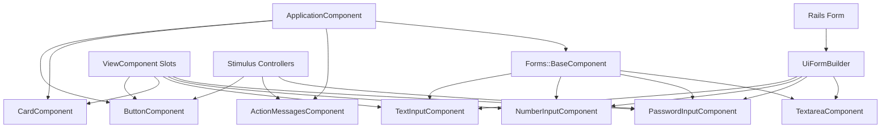

# BetterUi Components API Reference

## Overview

This document provides comprehensive API documentation for all BetterUi components. Each component is built using ViewComponent architecture and styled with Tailwind CSS v4 classes. All components inherit from `BetterUi::ApplicationComponent` which provides common functionality and styling patterns.

## Table of Contents

1. [ApplicationComponent (Base Class)](#applicationcomponent-base-class)
2. [ButtonComponent](#buttoncomponent)
3. [CardComponent](#cardcomponent)
4. [ActionMessagesComponent](#actionmessagescomponent)
5. [Form Components](#form-components)
   - [Forms::BaseComponent](#formsbasecomponent)
   - [Forms::TextInputComponent](#formstextinputcomponent)
   - [Forms::NumberInputComponent](#formsnumberinputcomponent)
   - [Forms::PasswordInputComponent](#formspasswordinputcomponent)
   - [Forms::TextareaComponent](#formstextareacomponent)
6. [UiFormBuilder](#uiformbuilder)

## Information Flow



## ApplicationComponent (Base Class)

### Description

The base component class that all BetterUi components inherit from. Provides common configuration, helper methods, and consistent behavior across all components.

### Constants

#### VARIANTS

Defines the 9 color variants available throughout BetterUi with their default color shades:

```ruby
VARIANTS = {
  primary: 600,      # Strong, trustworthy actions
  secondary: 500,    # Neutral, supporting elements
  accent: 500,       # Highlights and special features
  success: 600,      # Positive actions, confirmations
  danger: 600,       # Destructive actions, errors
  warning: 500,      # Caution, alerts
  info: 500,         # Informational, tips
  light: 100,        # Light backgrounds and light text
  dark: 900          # Dark backgrounds and dark text
}.freeze
```

### Helper Methods

#### css_classes(*classes)

Merges CSS classes intelligently using TailwindMerge to resolve conflicting utility classes.

```ruby
# Example:
css_classes("px-4 py-2", "px-6") #=> "py-2 px-6"
```

### Usage Pattern

```ruby
class BetterUi::MyComponent < BetterUi::ApplicationComponent
  # Component implementation
end
```

### Best Practices

- Use composition over inheritance
- Keep instance methods private
- Pass data explicitly (avoid global state)
- Test against rendered content, not internals

---

## ButtonComponent

### Description

A versatile button component with multiple styles, sizes, variants, and interactive states. Supports loading indicators, icons, and Stimulus controller integration for dynamic behavior.

### Parameters

| Parameter | Type | Default | Description |
|-----------|------|---------|-------------|
| `variant` | Symbol | `:primary` | Color variant (see VARIANTS constant) |
| `style` | Symbol | `:solid` | Visual style: `:solid`, `:outline`, `:ghost`, `:soft` |
| `size` | Symbol | `:md` | Size: `:xs`, `:sm`, `:md`, `:lg`, `:xl` |
| `show_loader` | Boolean | `false` | Shows loading spinner when true |
| `show_loader_on_click` | Boolean | `false` | Shows loader after click (via Stimulus) |
| `disabled` | Boolean | `false` | Disables the button |
| `type` | Symbol | `:button` | Button type: `:button`, `:submit`, `:reset` |
| `container_classes` | String | `nil` | Additional CSS classes |
| `**options` | Hash | `{}` | Additional HTML attributes |

### Slots

- `icon_before` - Icon rendered before the button text
- `icon_after` - Icon rendered after the button text

### Size Configurations

```ruby
SIZES = {
  xs: { padding: "px-2 py-1", text: "text-xs", icon: "w-3 h-3", gap: "gap-1" },
  sm: { padding: "px-3 py-1.5", text: "text-sm", icon: "w-4 h-4", gap: "gap-1.5" },
  md: { padding: "px-4 py-2", text: "text-base", icon: "w-5 h-5", gap: "gap-2" },
  lg: { padding: "px-5 py-2.5", text: "text-lg", icon: "w-6 h-6", gap: "gap-2.5" },
  xl: { padding: "px-6 py-3", text: "text-xl", icon: "w-7 h-7", gap: "gap-3" }
}
```

### Usage Examples

#### Basic Button

```erb
<%= render BetterUi::ButtonComponent.new(
  label: "Click me"
) %>
```

#### Styled Submit Button

```erb
<%= render BetterUi::ButtonComponent.new(
  label: "Submit Form",
  variant: "success",
  style: "solid",
  type: "submit",
  size: "lg"
) %>
```

#### Button with Icons

```erb
<%= render BetterUi::ButtonComponent.new(
  label: "Download"
) do |c| %>
  <% c.with_icon_before do %>
    <svg class="w-5 h-5"><!-- Download icon --></svg>
  <% end %>
<% end %>
```

#### Loading Button

```erb
<%= render BetterUi::ButtonComponent.new(
  label: "Processing...",
  show_loader: true,
  disabled: true
) %>
```

#### Auto-Loading on Click

```erb
<%= render BetterUi::ButtonComponent.new(
  label: "Save Changes",
  show_loader_on_click: true,
  type: "submit"
) %>
```

### Stimulus Controller

The button component includes a `better-ui--button` Stimulus controller that handles:
- Click events
- Auto-loading state on click
- Dynamic state management

### Common Patterns

#### Danger Confirmation Button

```erb
<%= render BetterUi::ButtonComponent.new(
  label: "Delete",
  variant: "danger",
  style: "outline",
  data: {
    turbo_confirm: "Are you sure?",
    turbo_method: "delete"
  }
) %>
```

#### Button Group

```erb
<div class="flex gap-2">
  <%= render BetterUi::ButtonComponent.new(label: "Cancel", variant: "secondary", style: "ghost") %>
  <%= render BetterUi::ButtonComponent.new(label: "Save", variant: "primary") %>
</div>
```

---

## CardComponent

### Description

A flexible container component that provides structured content areas with consistent padding, borders, and optional shadow effects.

### Parameters

| Parameter | Type | Default | Description |
|-----------|------|---------|-------------|
| `size` | Symbol | `:md` | Size variant affecting padding: `:sm`, `:md`, `:lg`, `:xl` |
| `bordered` | Boolean | `true` | Shows border around card |
| `shadow` | Symbol/Boolean | `false` | Shadow depth: `false`, `:sm`, `:md`, `:lg`, `:xl` |
| `container_classes` | String | `nil` | Additional CSS classes |

### Slots

- `header` - Top section of the card
- `body` - Main content area
- `footer` - Bottom section of the card

### Usage Examples

#### Basic Card

```erb
<%= render BetterUi::CardComponent.new do |c| %>
  <% c.with_body do %>
    <p>Card content goes here</p>
  <% end %>
<% end %>
```

#### Full Card Structure

```erb
<%= render BetterUi::CardComponent.new(size: "lg", shadow: "md") do |c| %>
  <% c.with_header do %>
    <h3 class="text-lg font-semibold">Card Title</h3>
  <% end %>

  <% c.with_body do %>
    <p>Main content area with automatic padding based on size.</p>
  <% end %>

  <% c.with_footer do %>
    <div class="flex justify-end gap-2">
      <%= render BetterUi::ButtonComponent.new(label: "Cancel", style: "ghost") %>
      <%= render BetterUi::ButtonComponent.new(label: "Save") %>
    </div>
  <% end %>
<% end %>
```

#### Borderless Card

```erb
<%= render BetterUi::CardComponent.new(bordered: false, shadow: "lg") do |c| %>
  <% c.with_body { "Shadow-only card without border" } %>
<% end %>
```

### Common Patterns

#### Profile Card

```erb
<%= render BetterUi::CardComponent.new do |c| %>
  <% c.with_body do %>
    <div class="flex items-center gap-4">
      
      <div>
        <h3 class="font-semibold">John Doe</h3>
        <p class="text-gray-600">Software Developer</p>
      </div>
    </div>
  <% end %>
<% end %>
```

---

## ActionMessagesComponent

### Description

Displays a list of messages with customizable styles and variants. Perfect for form validation errors, flash notifications, success messages, and warnings. Supports dismissible functionality and auto-dismiss timers.

### Parameters

| Parameter | Type | Default | Description |
|-----------|------|---------|-------------|
| `messages` | Array<String> | `[]` | List of messages to display |
| `variant` | Symbol | `:info` | Color variant (see VARIANTS) |
| `style` | Symbol | `:soft` | Visual style: `:solid`, `:soft`, `:outline`, `:ghost` |
| `dismissible` | Boolean | `false` | Shows dismiss button |
| `auto_dismiss` | Integer/Float/nil | `nil` | Auto-dismiss after N seconds |
| `title` | String/nil | `nil` | Optional title/heading |
| `container_classes` | String/nil | `nil` | Additional CSS classes |

### Usage Examples

#### Basic Message

```erb
<%= render BetterUi::ActionMessagesComponent.new(
  messages: ["Operation completed successfully"]
) %>
```

#### Form Validation Errors

```erb
<%= render BetterUi::ActionMessagesComponent.new(
  variant: "danger",
  title: "Please correct the following errors:",
  messages: @user.errors.full_messages
) %>
```

#### Success Notification with Auto-Dismiss

```erb
<%= render BetterUi::ActionMessagesComponent.new(
  variant: "success",
  style: "solid",
  dismissible: true,
  auto_dismiss: 5,
  messages: ["Your changes have been saved."]
) %>
```

#### Warning Alert

```erb
<%= render BetterUi::ActionMessagesComponent.new(
  variant: "warning",
  style: "outline",
  title: "Warning",
  messages: ["This action cannot be undone", "Please confirm before proceeding"],
  dismissible: true
) %>
```

### Stimulus Controller

Includes an action messages controller that handles:
- Dismiss functionality
- Auto-dismiss timer
- Fade out animation

### Common Patterns

#### Flash Messages

```erb
<% if flash.any? %>
  <% flash.each do |type, message| %>
    <%= render BetterUi::ActionMessagesComponent.new(
      variant: flash_variant(type),
      messages: [message],
      dismissible: true,
      auto_dismiss: 5
    ) %>
  <% end %>
<% end %>
```

---

## Form Components

### Forms::BaseComponent

#### Description

Abstract base class for all form input components. Provides common functionality for labels, hints, errors, and consistent styling patterns.

#### Common Parameters

All form components inherit these parameters:

| Parameter | Type | Default | Description |
|-----------|------|---------|-------------|
| `name` | String | Required | Input field name attribute |
| `value` | Any | `nil` | Current field value |
| `label` | String | `nil` | Label text |
| `hint` | String | `nil` | Hint text below input |
| `placeholder` | String | `nil` | Placeholder text |
| `size` | Symbol | `:md` | Size: `:xs`, `:sm`, `:md`, `:lg`, `:xl` |
| `disabled` | Boolean | `false` | Disables the input |
| `readonly` | Boolean | `false` | Makes input read-only |
| `required` | Boolean | `false` | Marks field as required |
| `errors` | Array<String> | `[]` | Validation error messages |
| `container_classes` | String | `nil` | Container CSS classes |
| `label_classes` | String | `nil` | Label CSS classes |
| `input_classes` | String | `nil` | Input field CSS classes |
| `hint_classes` | String | `nil` | Hint text CSS classes |
| `error_classes` | String | `nil` | Error message CSS classes |

#### Common Slots

- `prefix_icon` - Icon before the input field
- `suffix_icon` - Icon after the input field

---

### Forms::TextInputComponent

#### Description

Standard text input field with full validation and icon support.

#### Additional Parameters

Inherits all parameters from `Forms::BaseComponent` (no additional parameters).

#### Usage Examples

```erb
<%= render BetterUi::Forms::TextInputComponent.new(
  name: "user[email]",
  label: "Email Address",
  hint: "We'll never share your email",
  placeholder: "you@example.com",
  required: true
) %>
```

#### With Icons

```erb
<%= render BetterUi::Forms::TextInputComponent.new(
  name: "user[username]",
  label: "Username"
) do |c| %>
  <% c.with_prefix_icon { "@" } %>
<% end %>
```

#### With Errors

```erb
<%= render BetterUi::Forms::TextInputComponent.new(
  name: "user[email]",
  label: "Email",
  value: "invalid-email",
  errors: ["Email is invalid", "Email has already been taken"]
) %>
```

---

### Forms::NumberInputComponent

#### Description

Numeric input field with min/max validation and optional spinner controls.

#### Additional Parameters

| Parameter | Type | Default | Description |
|-----------|------|---------|-------------|
| `min` | Numeric | `nil` | Minimum value |
| `max` | Numeric | `nil` | Maximum value |
| `step` | Numeric | `nil` | Step increment |
| `show_spinner` | Boolean | `true` | Shows up/down arrows |

#### Usage Examples

```erb
<%= render BetterUi::Forms::NumberInputComponent.new(
  name: "product[price]",
  label: "Price",
  min: 0,
  max: 99999,
  step: 0.01,
  placeholder: "0.00"
) do |c| %>
  <% c.with_prefix_icon { "$" } %>
<% end %>
```

#### Without Spinners

```erb
<%= render BetterUi::Forms::NumberInputComponent.new(
  name: "user[age]",
  label: "Age",
  min: 0,
  max: 120,
  show_spinner: false
) %>
```

---

### Forms::PasswordInputComponent

#### Description

Password input field with built-in visibility toggle functionality.

#### Additional Parameters

Inherits all parameters from `Forms::BaseComponent`. The visibility toggle is automatically included via Stimulus controller.

#### Usage Examples

```erb
<%= render BetterUi::Forms::PasswordInputComponent.new(
  name: "user[password]",
  label: "Password",
  hint: "Must be at least 8 characters",
  required: true
) %>
```

#### With Confirmation Field

```erb
<%= render BetterUi::Forms::PasswordInputComponent.new(
  name: "user[password]",
  label: "Password"
) %>

<%= render BetterUi::Forms::PasswordInputComponent.new(
  name: "user[password_confirmation]",
  label: "Confirm Password"
) %>
```

#### Stimulus Controller

The password component includes a visibility toggle controller that:
- Shows/hides password text
- Updates toggle icon
- Maintains cursor position

---

### Forms::TextareaComponent

#### Description

Multi-line text input with adjustable rows and resize behavior.

#### Additional Parameters

| Parameter | Type | Default | Description |
|-----------|------|---------|-------------|
| `rows` | Integer | `4` | Number of visible text lines |
| `cols` | Integer | `nil` | Width in characters |
| `maxlength` | Integer | `nil` | Maximum character count |
| `resize` | Symbol | `:vertical` | Resize behavior: `:none`, `:vertical`, `:horizontal`, `:both` |

#### Usage Examples

```erb
<%= render BetterUi::Forms::TextareaComponent.new(
  name: "post[content]",
  label: "Content",
  rows: 10,
  placeholder: "Write your content here...",
  maxlength: 5000,
  hint: "Maximum 5000 characters"
) %>
```

#### Fixed Size Textarea

```erb
<%= render BetterUi::Forms::TextareaComponent.new(
  name: "user[bio]",
  label: "Bio",
  rows: 6,
  resize: "none"
) %>
```

---

## UiFormBuilder

### Description

Custom Rails form builder that integrates BetterUi form components with Rails forms. Automatically handles field values, validation errors, and required status from ActiveModel objects.

### Setup

```erb
<%= form_with model: @user, builder: BetterUi::UiFormBuilder do |f| %>
  <!-- form fields -->
<% end %>
```

### Available Methods

#### ui_text_input(attribute, options = {})

Renders a text input field.

```erb
<%= f.ui_text_input :email,
  hint: "We'll never share your email",
  placeholder: "you@example.com" %>
```

#### ui_number_input(attribute, options = {})

Renders a number input field.

```erb
<%= f.ui_number_input :age, min: 0, max: 120 %>
<%= f.ui_number_input :price, min: 0, step: 0.01 do |c| %>
  <% c.with_prefix_icon { "$" } %>
<% end %>
```

#### ui_password_input(attribute, options = {})

Renders a password input field.

```erb
<%= f.ui_password_input :password,
  hint: "Must be at least 8 characters" %>
```

#### ui_textarea(attribute, options = {})

Renders a textarea field.

```erb
<%= f.ui_textarea :description,
  rows: 6,
  maxlength: 500,
  hint: "Maximum 500 characters" %>
```

### Complete Form Example

```erb
<%= form_with model: @user, builder: BetterUi::UiFormBuilder do |f| %>
  <div class="space-y-6">
    <%= f.ui_text_input :name, label: "Full Name" %>

    <%= f.ui_text_input :email do |c| %>
      <% c.with_prefix_icon do %>
        <svg class="w-5 h-5 text-gray-400">
          <!-- Email icon SVG -->
        </svg>
      <% end %>
    <% end %>

    <%= f.ui_password_input :password %>
    <%= f.ui_password_input :password_confirmation %>

    <%= f.ui_number_input :age, min: 18, max: 120 %>

    <%= f.ui_textarea :bio, rows: 4, maxlength: 200 %>

    <div class="flex gap-2">
      <%= render BetterUi::ButtonComponent.new(
        label: "Cancel",
        variant: "secondary",
        style: "ghost"
      ) %>
      <%= render BetterUi::ButtonComponent.new(
        label: "Save User",
        type: "submit",
        show_loader_on_click: true
      ) %>
    </div>
  </div>
<% end %>
```

### Automatic Features

The form builder automatically:
- Populates field values from the model
- Displays validation errors
- Marks required fields based on presence validators
- Generates proper field names for nested attributes
- Handles all standard HTML attributes

## Implementation Steps

### Step 1: Add BetterUi to Your Gemfile

```ruby
gem "better_ui"
```

### Step 2: Install and Configure

```bash
bundle install
bin/rails generate better_ui:install
npm install tailwindcss@next @tailwindcss/postcss@next
```

### Step 3: Configure Your Layout

```erb
<!DOCTYPE html>
<html>
  <head>
    <%= stylesheet_link_tag "application", "data-turbo-track": "reload" %>
    <%= javascript_importmap_tags %>
  </head>
  <body>
    <%= yield %>
  </body>
</html>
```

### Step 4: Start Using Components

```erb
# In any view or partial:
<%= render BetterUi::ButtonComponent.new(label: "Get Started") %>
```

### Step 5: Use Form Builder for Forms

```erb
<%= form_with model: @model, builder: BetterUi::UiFormBuilder do |f| %>
  <!-- Use f.ui_* methods -->
<% end %>
```

## Best Practices

1. **Always specify variants explicitly** - Don't rely on defaults in production code
2. **Use semantic variants** - Match variant to intent (success for positive, danger for destructive)
3. **Leverage slots for icons** - Use ViewComponent slots for maintainable icon integration
4. **Handle errors at form level** - Let UiFormBuilder handle error display automatically
5. **Test component rendering** - Test the rendered HTML, not component internals
6. **Customize via CSS classes** - Use container_classes and other *_classes parameters for customization
7. **Keep components simple** - Compose complex UIs from simple components

## Troubleshooting

### Components Not Styled

Ensure your `application.postcss.css` includes:
```css
@source "../../../vendor/bundle/**/*.{rb,erb}";
```

### Form Builder Not Working

Verify you're using the correct builder:
```erb
builder: BetterUi::UiFormBuilder
```

### Validation Errors Not Showing

Ensure your model has ActiveModel validations and the form is submitted with errors.

### Stimulus Controllers Not Working

Check that importmap or your JS bundler includes the Stimulus controllers from BetterUi.

## Related Documentation

- [Installation Guide](INSTALLATION.md)
- [Customization Guide](CUSTOMIZATION.md)
- [Changelog](../CHANGELOG.md)
