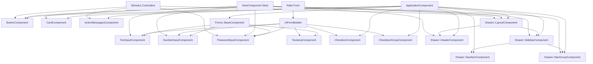

# BetterUi Components API Reference

## Overview

This document provides an index to all BetterUi components. Each component is built using ViewComponent architecture and styled with Tailwind CSS v4 classes. All components inherit from `BetterUi::ApplicationComponent` which provides common functionality and styling patterns.

## Quick Start

BetterUi provides two ways to use components:

### Helper Syntax (Recommended)

```erb
<%# Simple and concise %>
<%= bui_button(variant: :primary) { "Click me" } %>

<%= bui_card do |c| %>
  <% c.with_body { "Content" } %>
<% end %>

<%# Form components %>
<%= form_with model: @user, builder: BetterUi::UiFormBuilder do |f| %>
  <%= f.bui_text_input :email %>
  <%= f.bui_password_input :password %>
<% end %>
```

### Direct Render Syntax

```erb
<%# Full ViewComponent syntax %>
<%= render BetterUi::ButtonComponent.new(
  label: "Click me",
  variant: :primary
) %>
```

## Components

### Core Components

| Component | Description | Helper |
|-----------|-------------|--------|
| [ButtonComponent](components/button.md) | Versatile button with multiple styles, sizes, and variants | `bui_button` |
| [CardComponent](components/card.md) | Flexible container with header, body, and footer slots | `bui_card` |
| [ActionMessagesComponent](components/action_messages.md) | Flash messages and validation error display | `bui_action_messages` |

### Form Components

All form components support both standalone helpers and form builder integration.

| Component | Description | Helper | Form Builder |
|-----------|-------------|--------|--------------|
| [TextInputComponent](components/forms/text_input.md) | Standard text input with icon support | `bui_text_input` | `f.bui_text_input` |
| [NumberInputComponent](components/forms/number_input.md) | Numeric input with min/max and step | `bui_number_input` | `f.bui_number_input` |
| [PasswordInputComponent](components/forms/password_input.md) | Password input with visibility toggle | `bui_password_input` | `f.bui_password_input` |
| [TextareaComponent](components/forms/textarea.md) | Multi-line text input | `bui_textarea` | `f.bui_textarea` |
| [CheckboxComponent](components/forms/checkbox.md) | Single checkbox with label | `bui_checkbox` | `f.bui_checkbox` |
| [CheckboxGroupComponent](components/forms/checkbox_group.md) | Multiple checkboxes for multi-select | `bui_checkbox_group` | `f.bui_checkbox_group` |

### Drawer/Layout Components

| Component | Description | Helper |
|-----------|-------------|--------|
| [LayoutComponent](components/drawer/layout.md) | Responsive page layout with sidebar | `bui_drawer_layout` |
| [HeaderComponent](components/drawer/header.md) | Sticky header with logo and navigation | `bui_drawer_header` |
| [SidebarComponent](components/drawer/sidebar.md) | Responsive sidebar/drawer | `bui_drawer_sidebar` |
| [NavItemComponent](components/drawer/nav_item.md) | Navigation item with icon and badge | `bui_drawer_nav_item` |
| [NavGroupComponent](components/drawer/nav_group.md) | Grouped navigation with title | `bui_drawer_nav_group` |

## Component Hierarchy



## ApplicationComponent (Base Class)

The base component class that all BetterUi components inherit from. Provides common configuration, helper methods, and consistent behavior across all components.

### Constants

#### VARIANTS

Defines the 9 color variants available throughout BetterUi with their default color shades:

```ruby
VARIANTS = {
  primary: 600,      # Strong, trustworthy actions
  secondary: 500,    # Neutral, supporting elements
  accent: 500,       # Highlights and special features
  success: 600,      # Positive actions, confirmations
  danger: 600,       # Destructive actions, errors
  warning: 500,      # Caution, alerts
  info: 500,         # Informational, tips
  light: 100,        # Light backgrounds and light text
  dark: 900          # Dark backgrounds and dark text
}.freeze
```

### Helper Methods

#### css_classes(*classes)

Merges CSS classes intelligently using TailwindMerge to resolve conflicting utility classes.

```ruby
# Example:
css_classes("px-4 py-2", "px-6") #=> "py-2 px-6"
```

## UiFormBuilder

Custom Rails form builder that integrates BetterUi form components with Rails forms. Automatically handles field values, validation errors, and required status from ActiveModel objects.

### Setup

```erb
<%= form_with model: @user, builder: BetterUi::UiFormBuilder do |f| %>
  <%= f.bui_text_input :email %>
  <%= f.bui_password_input :password %>
  <%= f.bui_checkbox :terms, label: "I agree to the terms" %>

  <%= bui_button(type: :submit) { "Submit" } %>
<% end %>
```

### Automatic Features

The form builder automatically:
- Populates field values from the model
- Displays validation errors
- Marks required fields based on presence validators
- Generates proper field names for nested attributes
- Handles all standard HTML attributes

## Best Practices

1. **Use helpers for concise code** - Prefer `bui_button` over `render BetterUi::ButtonComponent.new`
2. **Always specify variants explicitly** - Don't rely on defaults in production code
3. **Use semantic variants** - Match variant to intent (success for positive, danger for destructive)
4. **Leverage slots for icons** - Use ViewComponent slots for maintainable icon integration
5. **Handle errors at form level** - Let UiFormBuilder handle error display automatically
6. **Customize via CSS classes** - Use container_classes and other *_classes parameters for customization
7. **Keep components simple** - Compose complex UIs from simple components

## Troubleshooting

### Components Not Styled

Ensure your `application.postcss.css` includes:
```css
@source "../../../vendor/bundle/**/*.{rb,erb}";
```

### Form Builder Not Working

Verify you're using the correct builder:
```erb
builder: BetterUi::UiFormBuilder
```

### Validation Errors Not Showing

Ensure your model has ActiveModel validations and the form is submitted with errors.

### Stimulus Controllers Not Working

Check that importmap or your JS bundler includes the Stimulus controllers from BetterUi.

## Related Documentation

- [Installation Guide](INSTALLATION.md)
- [Customization Guide](CUSTOMIZATION.md)
- [Changelog](../CHANGELOG.md)
