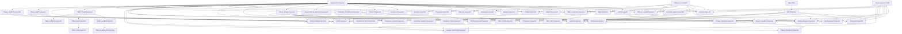

# BetterUi Components API Reference

## Overview

This document provides an index to all BetterUi components. Each component is built using ViewComponent architecture and styled with Tailwind CSS v4 classes. All components inherit from `BetterUi::ApplicationComponent` which provides common functionality and styling patterns.

## Quick Start

BetterUi provides two ways to use components:

### Helper Syntax (Recommended)

```erb
<%# Simple and concise %>
<%= bui_button(variant: :primary) { "Click me" } %>

<%= bui_card do |c| %>
  <% c.with_body { "Content" } %>
<% end %>

<%# Form components %>
<%= form_with model: @user, builder: BetterUi::UiFormBuilder do |f| %>
  <%= f.bui_text_input :email %>
  <%= f.bui_password_input :password %>
<% end %>
```

### Direct Render Syntax

```erb
<%# Full ViewComponent syntax (alternative to helpers) %>
<%= bui_button(variant: :primary) { "Click me" } %>
```

## Components

### Core Components

| Component | Description | Helper | Docs |
|-----------|-------------|--------|------|
| ButtonComponent | Versatile button with multiple styles, sizes, and variants | `bui_button` | [button.md](components/button.md) |
| LinkComponent | Styled link with variants, icons, and sizes | `bui_link` | [link.md](components/link.md) |
| CardComponent | Flexible container with header, body, and footer slots | `bui_card` | [card.md](components/card.md) |
| ActionMessagesComponent | Flash messages and validation error display | `bui_action_messages` | [action_messages.md](components/action_messages.md) |
| AvatarComponent | User avatar with image, initials, and status indicator | `bui_avatar` | [avatar.md](components/avatar.md) |
| BadgeComponent | Label badge with dot, counter, and pill modes | `bui_badge` | [badge.md](components/badge.md) |
| TagComponent | Dismissible tag with link support | `bui_tag` | [tag.md](components/tag.md) |
| HeadingComponent | Semantic heading (h1-h6) with subtitle and actions | `bui_heading` | [heading.md](components/heading.md) |
| SpinnerComponent | Loading indicator with color and size variants | `bui_spinner` | [spinner.md](components/spinner.md) |
| ProgressComponent | Progress bar with label and animation | `bui_progress` | [progress.md](components/progress.md) |
| DividerComponent | Visual separator with label and orientation | `bui_divider` | [divider.md](components/divider.md) |
| TooltipComponent | Stimulus-powered tooltip with fixed positioning | `bui_tooltip` | [tooltip.md](components/tooltip.md) |
| ContainerComponent | Responsive max-width content wrapper | `bui_container` | [container.md](components/container.md) |
| FaIconComponent | FontAwesome icon wrapper with animations | `bui_fa_icon` | [fa_icon.md](components/fa_icon.md) |
| Breadcrumb | Breadcrumb navigation with configurable separators | `bui_breadcrumb` | [breadcrumb.md](components/breadcrumb.md) |

### Form Components

All form components support both standalone helpers and form builder integration.

| Component | Description | Helper | Form Builder | Docs |
|-----------|-------------|--------|--------------|------|
| TextInputComponent | Standard text input with icon support | `bui_text_input` | `f.bui_text_input` | [text_input.md](components/forms/text_input.md) |
| EmailInputComponent | Email input (TextInput with type: :email) | `bui_email_input` | — | — |
| TelInputComponent | Telephone input (TextInput with type: :tel) | `bui_tel_input` | — | — |
| DateInputComponent | Date input (TextInput with type: :date) | `bui_date_input` | — | — |
| TimeInputComponent | Time input (TextInput with type: :time) | `bui_time_input` | — | — |
| NumberInputComponent | Numeric input with min/max and step | `bui_number_input` | `f.bui_number_input` | [number_input.md](components/forms/number_input.md) |
| PasswordInputComponent | Password input with visibility toggle | `bui_password_input` | `f.bui_password_input` | [password_input.md](components/forms/password_input.md) |
| TextareaComponent | Multi-line text input | `bui_textarea` | `f.bui_textarea` | [textarea.md](components/forms/textarea.md) |
| CheckboxComponent | Single checkbox with label | `bui_checkbox` | `f.bui_checkbox` | [checkbox.md](components/forms/checkbox.md) |
| CheckboxGroupComponent | Multiple checkboxes for multi-select | `bui_checkbox_group` | `f.bui_checkbox_group` | [checkbox_group.md](components/forms/checkbox_group.md) |
| SelectComponent | Custom dropdown with keyboard navigation | `bui_select` | `f.bui_select` | [select.md](components/forms/select.md) |

### Table Components

| Component | Description | Helper | Docs |
|-----------|-------------|--------|------|
| TableComponent | Flexible table with slot-based and collection-based modes | `bui_table` | — |
| HeaderComponent | Table header row with header cell slots | — | — |
| HeaderCellComponent | Table header cell with scope, sortable indicators | — | — |
| RowComponent | Table body row with striping, hoverable, and highlighted support | — | — |
| CellComponent | Table body cell with alignment and sizing | — | — |
| ColumnComponent | Collection mode column configuration | — | — |

### Dialog Components

| Component | Description | Helper | Docs |
|-----------|-------------|--------|------|
| DialogComponent | Modal overlay with backdrop, size, and close behavior | `bui_dialog` | [dialog.md](components/dialog/dialog.md) |
| AlertComponent | Alert dialog with icon, message, and OK button | `bui_dialog_alert` | [alert.md](components/dialog/alert.md) |
| ConfirmComponent | Confirm dialog with Cancel and Confirm buttons | `bui_dialog_confirm` | [confirm.md](components/dialog/confirm.md) |

### Tabs Components

| Component | Description | Helper | Docs |
|-----------|-------------|--------|------|
| ContainerComponent | Tabs container with JS and Turbo modes | `bui_tabs` | [container.md](components/tabs/container.md) |
| TabComponent | Individual tab with icon, badge, and disabled state | `bui_tab` | [tab.md](components/tabs/tab.md) |
| PanelComponent | Tab panel content container | `bui_tab_panel` | [panel.md](components/tabs/panel.md) |

### Dropdown Components

| Component | Description | Helper | Docs |
|-----------|-------------|--------|------|
| DropdownComponent | Composable dropdown menu with keyboard nav and auto-close | `bui_dropdown` | [dropdown.md](components/dropdown/dropdown.md) |
| ItemComponent | Clickable menu item with icon, variant, and disabled state | — | [item.md](components/dropdown/item.md) |
| HeaderComponent | Non-interactive section title | — | [header.md](components/dropdown/header.md) |
| DividerComponent | Visual separator between items | — | [divider.md](components/dropdown/divider.md) |

### Drawer/Layout Components

| Component | Description | Helper | Docs |
|-----------|-------------|--------|------|
| LayoutComponent | Responsive page layout with sidebar | `bui_drawer_layout` | [layout.md](components/drawer/layout.md) |
| HeaderComponent | Sticky header with logo and navigation | `bui_drawer_header` | [header.md](components/drawer/header.md) |
| SidebarComponent | Responsive sidebar/drawer | `bui_drawer_sidebar` | [sidebar.md](components/drawer/sidebar.md) |
| NavItemComponent | Navigation item with icon and badge | `bui_drawer_nav_item` | [nav_item.md](components/drawer/nav_item.md) |
| NavGroupComponent | Grouped navigation with title | `bui_drawer_nav_group` | [nav_group.md](components/drawer/nav_group.md) |

## Component Hierarchy


```mermaid
graph TD
    A[ApplicationComponent] --> B[ButtonComponent]
    A --> B2[LinkComponent]
    A --> C[CardComponent]
    A --> D[ActionMessagesComponent]
    A --> AV[AvatarComponent]
    A --> BA[BadgeComponent]
    A --> TG[TagComponent]
    A --> HD[HeadingComponent]
    A --> SP[SpinnerComponent]
    A --> PR[ProgressComponent]
    A --> DV[DividerComponent]
    A --> TT[TooltipComponent]
    A --> CN[ContainerComponent]
    A --> FI[FaIconComponent]
    A --> BC[Breadcrumb::BreadcrumbComponent]
    BC --> BCI[Breadcrumb::ItemComponent]
    A --> E[Forms::BaseComponent]
    E --> F[TextInputComponent]
    E --> G[NumberInputComponent]
    E --> H[PasswordInputComponent]
    E --> I[TextareaComponent]
    E --> SEL[SelectComponent]
    A --> P[CheckboxComponent]
    A --> Q[CheckboxGroupComponent]
    A --> R[Drawer::LayoutComponent]
    A --> S[Drawer::HeaderComponent]
    A --> T[Drawer::SidebarComponent]
    A --> U[Drawer::NavItemComponent]
    A --> V[Drawer::NavGroupComponent]
    A --> Z1[Table::TableComponent]
    Z1 --> Z2[Table::HeaderComponent]
    Z1 --> Z3[Table::RowComponent]
    Z2 --> Z4[Table::HeaderCellComponent]
    Z3 --> Z5[Table::CellComponent]
    Z1 --> Z6[Table::ColumnComponent]
    A --> W[Dialog::DialogComponent]
    A --> X[Dialog::AlertComponent]
    A --> Y[Dialog::ConfirmComponent]
    A --> TB[Tabs::ContainerComponent]
    TB --> TBC[Tabs::TabComponent]
    TB --> TBP[Tabs::PanelComponent]
    A --> DD[Dropdown::DropdownComponent]
    DD --> DDI[Dropdown::ItemComponent]
    DD --> DDH[Dropdown::HeaderComponent]
    DD --> DDD[Dropdown::DividerComponent]
    R --> S
    R --> T
    T --> U
    T --> V
    X --> W
    X --> C
    Y --> W
    Y --> C
    J[UiFormBuilder] --> F
    J --> G
    J --> H
    J --> I
    J --> P
    J --> Q
    J --> SEL
    K[Rails Form] --> J
    L[ViewComponent Slots] --> B
    L --> C
    L --> F
    L --> G
    L --> H
    L --> R
    L --> S
    L --> T
    L --> V
    L --> TB
    M[Stimulus Controllers] --> B
    M --> D
    M --> H
    M --> R
    M --> W
    M --> TB
    M --> TG
    M --> SEL
    M --> TT
    M --> DD
```

## ApplicationComponent (Base Class)

The base component class that all BetterUi components inherit from. Provides common configuration, helper methods, and consistent behavior across all components.

### Constants

#### VARIANTS

Defines the 9 color variants available throughout BetterUi with their default color shades:

```ruby
VARIANTS = {
  primary: 600,      # Strong, trustworthy actions
  secondary: 500,    # Neutral, supporting elements
  accent: 500,       # Highlights and special features
  success: 600,      # Positive actions, confirmations
  danger: 600,       # Destructive actions, errors
  warning: 500,      # Caution, alerts
  info: 500,         # Informational, tips
  light: 100,        # Light backgrounds and light text
  dark: 900          # Dark backgrounds and dark text
}.freeze
```

### Helper Methods

#### css_classes(*classes)

Merges CSS classes intelligently using TailwindMerge to resolve conflicting utility classes.

```ruby
# Example:
css_classes("px-4 py-2", "px-6") #=> "py-2 px-6"
```

## UiFormBuilder

Custom Rails form builder that integrates BetterUi form components with Rails forms. Automatically handles field values, validation errors, and required status from ActiveModel objects.

### Setup

```erb
<%= form_with model: @user, builder: BetterUi::UiFormBuilder do |f| %>
  <%= f.bui_text_input :email %>
  <%= f.bui_password_input :password %>
  <%= f.bui_checkbox :terms, label: "I agree to the terms" %>
  <%= f.bui_select :country, [["Italy", "it"], ["France", "fr"]] %>

  <%= bui_button(type: :submit) { "Submit" } %>
<% end %>
```

### Automatic Features

The form builder automatically:
- Populates field values from the model
- Displays validation errors
- Marks required fields based on presence validators
- Generates proper field names for nested attributes
- Handles all standard HTML attributes

## Best Practices

1. **Use helpers for concise code** - Prefer `bui_button` over `render BetterUi::ButtonComponent.new`
2. **Always specify variants explicitly** - Don't rely on defaults in production code
3. **Use semantic variants** - Match variant to intent (success for positive, danger for destructive)
4. **Leverage slots for icons** - Use ViewComponent slots for maintainable icon integration
5. **Handle errors at form level** - Let UiFormBuilder handle error display automatically
6. **Customize via CSS classes** - Use container_classes and other *_classes parameters for customization
7. **Keep components simple** - Compose complex UIs from simple components

## Troubleshooting

### Components Not Styled

Ensure your `application.postcss.css` includes:
```css
@source "../../../vendor/bundle/**/*.{rb,erb}";
```

### Form Builder Not Working

Verify you're using the correct builder:
```erb
builder: BetterUi::UiFormBuilder
```

### Validation Errors Not Showing

Ensure your model has ActiveModel validations and the form is submitted with errors.

### Stimulus Controllers Not Working

Check that your JS bundler includes the Stimulus controllers from BetterUi and that `registerControllers(application)` is called.

## Related Documentation

- [Installation Guide](INSTALLATION.md)
- [Customization Guide](CUSTOMIZATION.md)
- [Changelog](../CHANGELOG.md)
