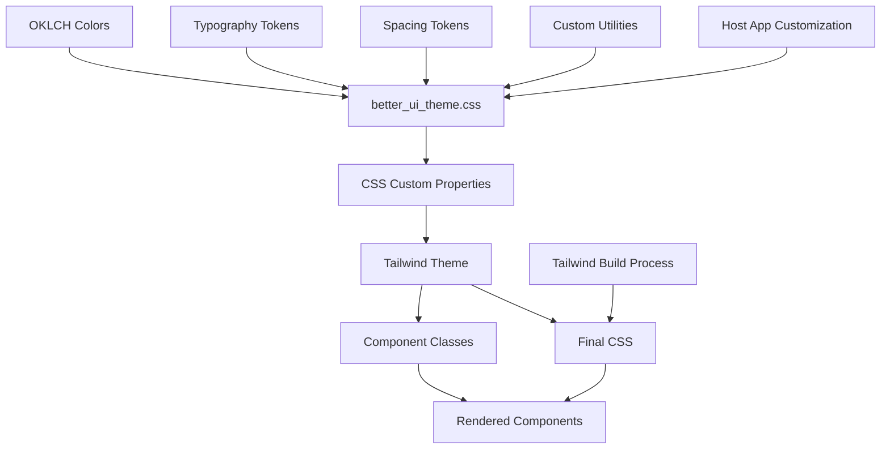

# BetterUi Customization & Theming Guide

**Date:** 2025-11-12
**Time:** 10:15
**Title:** Complete Theme Customization Documentation

## Overview

BetterUi uses a modern theming system built on Tailwind CSS v4's theme capabilities and the OKLCH color space for perceptually uniform colors. This guide explains how to customize colors, typography, spacing, and extend components to match your brand and design requirements.

## Table of Contents

1. [Understanding the Color System](#understanding-the-color-system)
2. [OKLCH Color Space](#oklch-color-space)
3. [Customizing Colors](#customizing-colors)
4. [Creating Custom Variants](#creating-custom-variants)
5. [Typography Customization](#typography-customization)
6. [Size Scales and Spacing](#size-scales-and-spacing)
7. [Extending Components](#extending-components)
8. [Custom Utility Classes](#custom-utility-classes)
9. [Dark Mode Considerations](#dark-mode-considerations)
10. [Advanced Patterns](#advanced-patterns)

## Information Flow



## Understanding the Color System

### The 9 Semantic Variants

BetterUi provides 9 semantic color variants, each with a specific purpose:

| Variant | Purpose | Default Shade | Use Cases |
|---------|---------|---------------|-----------|
| `primary` | Main brand color | 600 | Primary actions, brand elements |
| `secondary` | Supporting color | 500 | Secondary buttons, neutral elements |
| `accent` | Highlight color | 500 | Special features, highlights |
| `success` | Positive feedback | 600 | Success messages, confirmations |
| `danger` | Destructive/Error | 600 | Delete buttons, error states |
| `warning` | Caution | 500 | Warnings, important notices |
| `info` | Informational | 500 | Tips, information messages |
| `light` | Light elements | 100 | Light backgrounds, borders |
| `dark` | Dark elements | 900 | Dark mode, high contrast |

### Color Scale Structure

Each variant includes 11 shades from 50 (lightest) to 950 (darkest):

```css
--color-primary-50: /* Lightest - backgrounds */
--color-primary-100: /* Very light - hover states */
--color-primary-200: /* Light - active states */
--color-primary-300: /* Light-medium */
--color-primary-400: /* Medium-light */
--color-primary-500: /* Medium - base color */
--color-primary-600: /* Medium-dark - default */
--color-primary-700: /* Dark - hover */
--color-primary-800: /* Darker - active */
--color-primary-900: /* Very dark - text */
--color-primary-950: /* Darkest - high contrast */
```

## OKLCH Color Space

### What is OKLCH?

OKLCH (Oklab Lightness, Chroma, Hue) is a perceptually uniform color space that provides:
- **Better color consistency** across different hues
- **Predictable lightness** relationships
- **Smooth gradients** without muddy midpoints
- **Accessible contrast** calculations

### OKLCH Format

```css
oklch(lightness chroma hue)
```

- **Lightness (L)**: 0-1 (0 = black, 1 = white)
- **Chroma (C)**: 0-0.4 (0 = grayscale, 0.4 = maximum saturation)
- **Hue (H)**: 0-360 degrees (color wheel position)

### Hue Reference

| Hue Range | Color Family |
|-----------|--------------|
| 0-30 | Red |
| 30-60 | Orange |
| 60-90 | Yellow |
| 90-150 | Green |
| 150-240 | Blue |
| 240-300 | Purple |
| 300-360 | Pink/Red |

## Customizing Colors

### Location

Colors are defined in `app/assets/stylesheets/better_ui_theme.css`

### Modifying Existing Variants

To change the primary color to your brand blue:

```css
@theme inline {
  /* Original primary (indigo) */
  /* --color-primary-500: oklch(0.60 0.22 250); */

  /* Your brand blue */
  --color-primary-50: oklch(0.97 0.01 220);
  --color-primary-100: oklch(0.94 0.03 220);
  --color-primary-200: oklch(0.88 0.06 220);
  --color-primary-300: oklch(0.80 0.12 220);
  --color-primary-400: oklch(0.70 0.18 220);
  --color-primary-500: oklch(0.60 0.24 220); /* Base */
  --color-primary-600: oklch(0.50 0.26 220); /* Default */
  --color-primary-700: oklch(0.42 0.24 220);
  --color-primary-800: oklch(0.34 0.20 220);
  --color-primary-900: oklch(0.28 0.14 220);
  --color-primary-950: oklch(0.18 0.10 220);
}
```

### Creating Consistent Color Scales

#### Method 1: Adjust Lightness (Keep Brand Color)

```css
/* Start with your brand color at 500 */
--color-brand-500: oklch(0.60 0.20 280); /* Purple */

/* Scale lightness up and down */
--color-brand-50:  oklch(0.97 0.02 280); /* L +0.37 */
--color-brand-100: oklch(0.93 0.04 280); /* L +0.33 */
--color-brand-200: oklch(0.86 0.08 280); /* L +0.26 */
--color-brand-300: oklch(0.78 0.12 280); /* L +0.18 */
--color-brand-400: oklch(0.69 0.16 280); /* L +0.09 */
--color-brand-500: oklch(0.60 0.20 280); /* Base */
--color-brand-600: oklch(0.51 0.22 280); /* L -0.09 */
--color-brand-700: oklch(0.43 0.20 280); /* L -0.17 */
--color-brand-800: oklch(0.35 0.16 280); /* L -0.25 */
--color-brand-900: oklch(0.28 0.12 280); /* L -0.32 */
--color-brand-950: oklch(0.20 0.08 280); /* L -0.40 */
```

#### Method 2: Vary Chroma for Vibrancy

```css
/* More vibrant in middle, less at extremes */
--color-accent-50:  oklch(0.96 0.02 320); /* Low chroma */
--color-accent-500: oklch(0.65 0.30 320); /* High chroma */
--color-accent-950: oklch(0.22 0.10 320); /* Low chroma */
```

## Creating Custom Variants

### Adding a New Variant

To add a custom "brand" variant:

1. **Define the color scale in theme:**

```css
@theme inline {
  /* Existing variants... */

  /* Custom brand variant */
  --color-brand-50: oklch(0.97 0.02 280);
  --color-brand-100: oklch(0.93 0.04 280);
  --color-brand-200: oklch(0.86 0.08 280);
  --color-brand-300: oklch(0.78 0.12 280);
  --color-brand-400: oklch(0.69 0.16 280);
  --color-brand-500: oklch(0.60 0.20 280);
  --color-brand-600: oklch(0.51 0.22 280);
  --color-brand-700: oklch(0.43 0.20 280);
  --color-brand-800: oklch(0.35 0.16 280);
  --color-brand-900: oklch(0.28 0.12 280);
  --color-brand-950: oklch(0.20 0.08 280);
}
```

2. **Add utility classes (optional):**

```css
@layer utilities {
  .text-heading-brand {
    @apply text-brand-900 dark:text-brand-100;
  }
}
```

3. **Use in components:**

```erb
<div class="bg-brand-500 text-white">
  Custom brand element
</div>
```

## Typography Customization

### Font Families

Customize the font stacks in `better_ui_theme.css`:

```css
@theme inline {
  /* System fonts (default) */
  --font-family-sans: system-ui, -apple-system, "Segoe UI", sans-serif;

  /* Custom brand fonts */
  --font-family-sans: "Inter", system-ui, sans-serif;
  --font-family-serif: "Merriweather", Georgia, serif;
  --font-family-mono: "JetBrains Mono", Monaco, monospace;
}
```

### Loading Custom Fonts

Add to your application layout:

```html
<!-- Google Fonts -->
<link rel="preconnect" href="https://fonts.googleapis.com">
<link href="https://fonts.googleapis.com/css2?family=Inter:wght@400;500;600;700&display=swap" rel="stylesheet">

<!-- Or self-hosted -->
<style>
  @font-face {
    font-family: 'Inter';
    src: url('/fonts/Inter.woff2') format('woff2');
    font-weight: 400 700;
    font-display: swap;
  }
</style>
```

### Typography Scale

Customize text sizes:

```css
@theme inline {
  /* Custom text size scale */
  --text-xs: 0.75rem;    /* 12px */
  --text-sm: 0.875rem;   /* 14px */
  --text-base: 1rem;     /* 16px */
  --text-lg: 1.125rem;   /* 18px */
  --text-xl: 1.25rem;    /* 20px */
  --text-2xl: 1.5rem;    /* 24px */
  --text-3xl: 1.875rem;  /* 30px */
  --text-4xl: 2.25rem;   /* 36px */
}
```

## Size Scales and Spacing

### Customizing Component Sizes

Components use size variants (xs, sm, md, lg, xl). Customize padding/spacing:

```css
@theme inline {
  /* Custom spacing scale */
  --space-xs: 0.25rem;   /* 4px */
  --space-sm: 0.5rem;    /* 8px */
  --space-md: 1rem;      /* 16px */
  --space-lg: 1.5rem;    /* 24px */
  --space-xl: 2rem;      /* 32px */
  --space-2xl: 3rem;     /* 48px */
}
```

### Border Radius

```css
@theme inline {
  /* Custom radius scale */
  --radius-none: 0;
  --radius-sm: 0.125rem;   /* 2px */
  --radius-md: 0.375rem;   /* 6px */
  --radius-lg: 0.5rem;     /* 8px */
  --radius-xl: 0.75rem;    /* 12px */
  --radius-2xl: 1rem;      /* 16px */
  --radius-full: 9999px;
}
```

### Shadows

```css
@theme inline {
  /* Custom shadow scale */
  --shadow-sm: 0 1px 2px 0 rgb(0 0 0 / 0.05);
  --shadow-md: 0 4px 6px -1px rgb(0 0 0 / 0.1);
  --shadow-lg: 0 10px 15px -3px rgb(0 0 0 / 0.1);
  --shadow-xl: 0 20px 25px -5px rgb(0 0 0 / 0.1);
}
```

## Extending Components

### Method 1: CSS Class Overrides

Use the `container_classes` parameter:

```erb
<%= render BetterUi::ButtonComponent.new(
  label: "Custom Button",
  container_classes: "rounded-full shadow-lg hover:shadow-xl"
) %>
```

### Method 2: Component Inheritance

Create custom components that extend BetterUi:

```ruby
# app/components/my_app/button_component.rb
module MyApp
  class ButtonComponent < BetterUi::ButtonComponent
    def initialize(**options)
      # Add custom defaults
      options[:container_classes] = css_classes(
        "rounded-full",
        options[:container_classes]
      )
      super(**options)
    end

    private

    def custom_method
      # Add custom behavior
    end
  end
end
```

### Method 3: Component Composition

Wrap BetterUi components:

```ruby
# app/components/brand_button_component.rb
class BrandButtonComponent < ViewComponent::Base
  def initialize(label:, **options)
    @label = label
    @options = options
  end

  def call
    render BetterUi::ButtonComponent.new(
      label: @label,
      variant: "primary",
      container_classes: "brand-button-custom",
      **@options
    )
  end
end
```

## Custom Utility Classes

### Adding Project-Specific Utilities

In `better_ui_theme.css`:

```css
@layer utilities {
  /* Glass morphism effect */
  .glass {
    @apply bg-white/80 backdrop-blur-md border-white/20;
  }

  /* Gradient text */
  .gradient-text {
    @apply bg-gradient-to-r from-primary-600 to-accent-600 bg-clip-text text-transparent;
  }

  /* Custom animations */
  .animate-slide-up {
    animation: slideUp 0.3s ease-out;
  }

  @keyframes slideUp {
    from {
      opacity: 0;
      transform: translateY(10px);
    }
    to {
      opacity: 1;
      transform: translateY(0);
    }
  }

  /* Brand-specific components */
  .brand-card {
    @apply bg-white rounded-xl shadow-lg p-6 border border-primary-100;
  }

  .brand-input {
    @apply rounded-lg border-2 border-primary-200 focus:border-primary-500;
  }
}
```

### Using Custom Utilities

```erb
<div class="glass rounded-lg p-4">
  <h1 class="gradient-text text-3xl font-bold">
    Welcome
  </h1>
</div>

<div class="brand-card animate-slide-up">
  Custom styled card
</div>
```

## Dark Mode Considerations

### Color Adjustments

BetterUi components are dark-mode ready. Customize dark mode colors:

```css
@layer utilities {
  /* Semantic heading colors with dark mode */
  .text-heading-primary {
    @apply text-primary-900 dark:text-primary-100;
  }

  .bg-surface {
    @apply bg-white dark:bg-grayscale-900;
  }

  .bg-surface-secondary {
    @apply bg-grayscale-50 dark:bg-grayscale-800;
  }

  .border-default {
    @apply border-grayscale-200 dark:border-grayscale-700;
  }
}
```

### Dark Mode Toggle

Add a dark mode toggle to your app:

```erb
<button onclick="toggleDarkMode()" class="p-2">
  <span class="dark:hidden">🌙</span>
  <span class="hidden dark:inline">☀️</span>
</button>

<script>
  function toggleDarkMode() {
    document.documentElement.classList.toggle('dark');
    localStorage.theme = document.documentElement.classList.contains('dark') ? 'dark' : 'light';
  }

  // Initialize on load
  if (localStorage.theme === 'dark' || (!('theme' in localStorage) && window.matchMedia('(prefers-color-scheme: dark)').matches)) {
    document.documentElement.classList.add('dark');
  }
</script>
```

## Advanced Patterns

### Dynamic Theme Switching

Create multiple theme files and switch dynamically:

```css
/* themes/ocean.css */
@theme inline {
  --color-primary-500: oklch(0.60 0.25 220); /* Ocean blue */
  --color-accent-500: oklch(0.70 0.20 180);  /* Teal */
}

/* themes/forest.css */
@theme inline {
  --color-primary-500: oklch(0.55 0.20 140); /* Forest green */
  --color-accent-500: oklch(0.65 0.18 90);   /* Lime */
}
```

```javascript
// Theme switcher
function switchTheme(themeName) {
  document.documentElement.setAttribute('data-theme', themeName);
}
```

### Component-Specific Theming

Override colors for specific components:

```css
/* Custom button themes */
.btn-gradient {
  @apply bg-gradient-to-r from-primary-500 to-accent-500
         hover:from-primary-600 hover:to-accent-600
         text-white font-medium;
}

.btn-outline-gradient {
  @apply relative bg-white;
  background: linear-gradient(white, white) padding-box,
              linear-gradient(to right, var(--color-primary-500), var(--color-accent-500)) border-box;
  border: 2px solid transparent;
}
```

### Responsive Theming

Different themes for different screen sizes:

```css
@layer utilities {
  .responsive-padding {
    @apply p-4 sm:p-6 md:p-8 lg:p-10;
  }

  .responsive-text {
    @apply text-base sm:text-lg md:text-xl lg:text-2xl;
  }

  .responsive-grid {
    @apply grid grid-cols-1 sm:grid-cols-2 lg:grid-cols-3 xl:grid-cols-4 gap-4;
  }
}
```

## Implementation Steps

### Step 1: Analyze Your Brand

1. Identify primary brand colors
2. Define semantic color meanings
3. Determine typography preferences
4. Set spacing and sizing needs

### Step 2: Generate Color Scales

1. Start with brand colors at 500 level
2. Create lighter shades (50-400)
3. Create darker shades (600-950)
4. Test contrast ratios for accessibility

### Step 3: Update Theme File

```css
/* app/assets/stylesheets/better_ui_theme.css */
@theme inline {
  /* Your customized colors */
  --color-primary-500: oklch(0.60 0.24 YOUR_HUE);
  /* ... all shades ... */

  /* Your fonts */
  --font-family-sans: "Your Font", system-ui, sans-serif;

  /* Your spacing */
  --spacing-unit: 0.25rem;
}
```

### Step 4: Add Custom Utilities

```css
@layer utilities {
  /* Your custom utilities */
  .your-custom-class {
    @apply /* Tailwind utilities */;
  }
}
```

### Step 5: Test Components

Create a test page with all components to verify theming:

```erb
<!-- app/views/theme_test.html.erb -->
<div class="p-8 space-y-8">
  <% BetterUi::ApplicationComponent::VARIANTS.keys.each do |variant| %>
    <%= render BetterUi::ButtonComponent.new(
      label: variant.to_s.capitalize,
      variant: variant
    ) %>
  <% end %>
</div>
```

## Best Practices

1. **Maintain Contrast** - Ensure WCAG AA compliance (4.5:1 for text)
2. **Test All Variants** - Verify each color variant looks good
3. **Keep Consistency** - Use consistent lightness progression
4. **Document Changes** - Comment your customizations
5. **Version Control** - Track theme changes in git
6. **Test Dark Mode** - Ensure colors work in both modes
7. **Use Semantic Names** - Name variants by purpose, not color

## Troubleshooting

### Colors Not Applying

1. Check CSS import order
2. Verify theme file is loaded
3. Clear browser cache
4. Rebuild CSS with Tailwind

### Contrast Issues

Use OKLCH lightness to ensure proper contrast:
- Text on light bg: L < 0.40
- Text on dark bg: L > 0.60
- Minimum difference: 0.40

### Theme Not Updating

```bash
# Clear caches and rebuild
rm -rf tmp/cache
bin/rails assets:clobber
bin/rails assets:precompile
```

## Resources

- [OKLCH Color Picker](https://oklch.com)
- [Contrast Checker](https://webaim.org/resources/contrastchecker/)
- [Tailwind CSS v4 Docs](https://tailwindcss.com/docs)
- [ViewComponent Docs](https://viewcomponent.org)